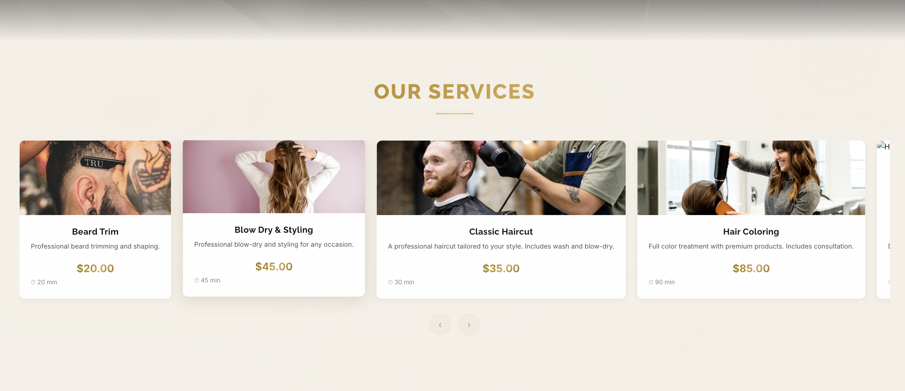
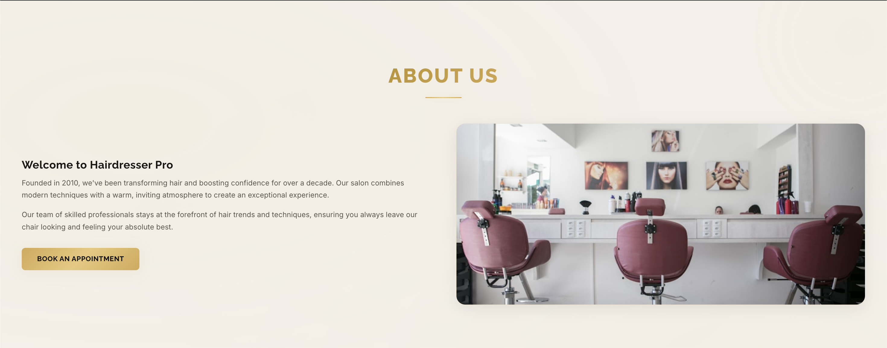
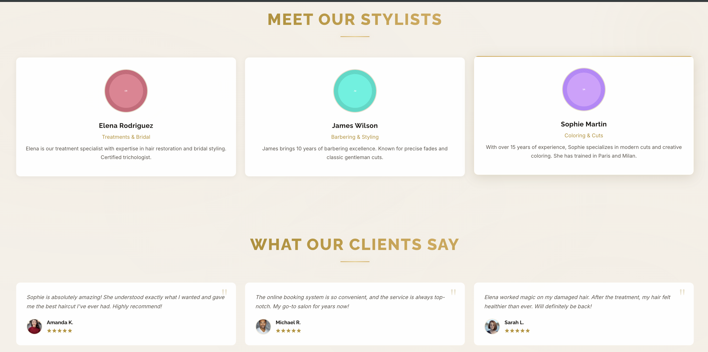
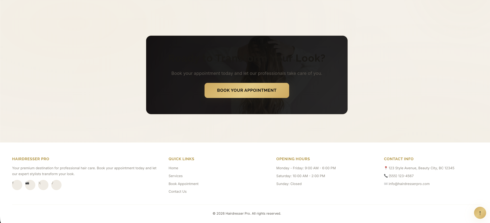
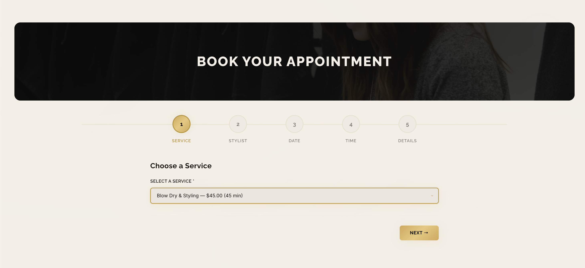
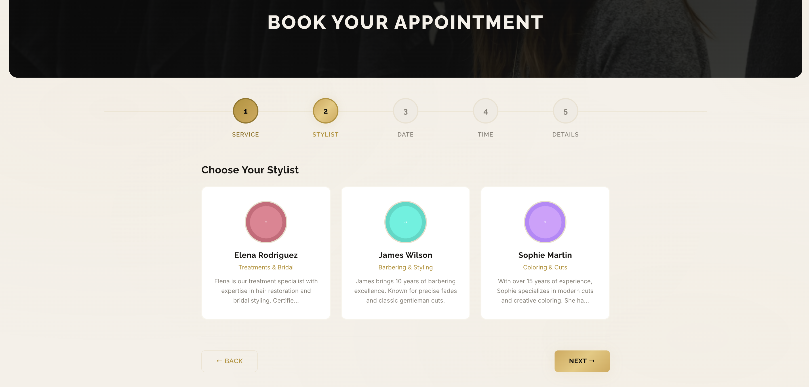
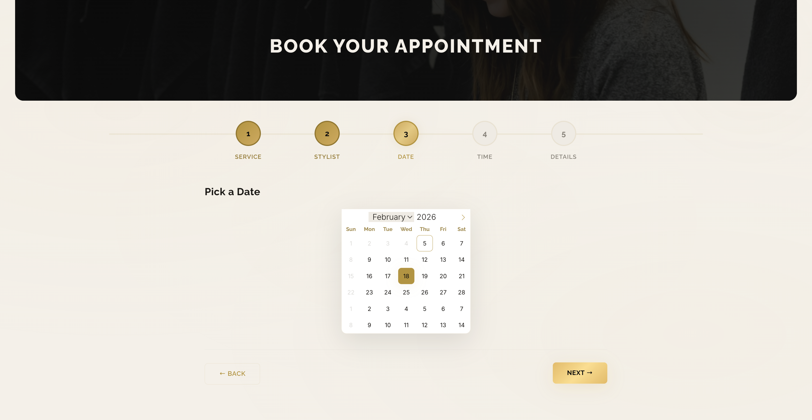
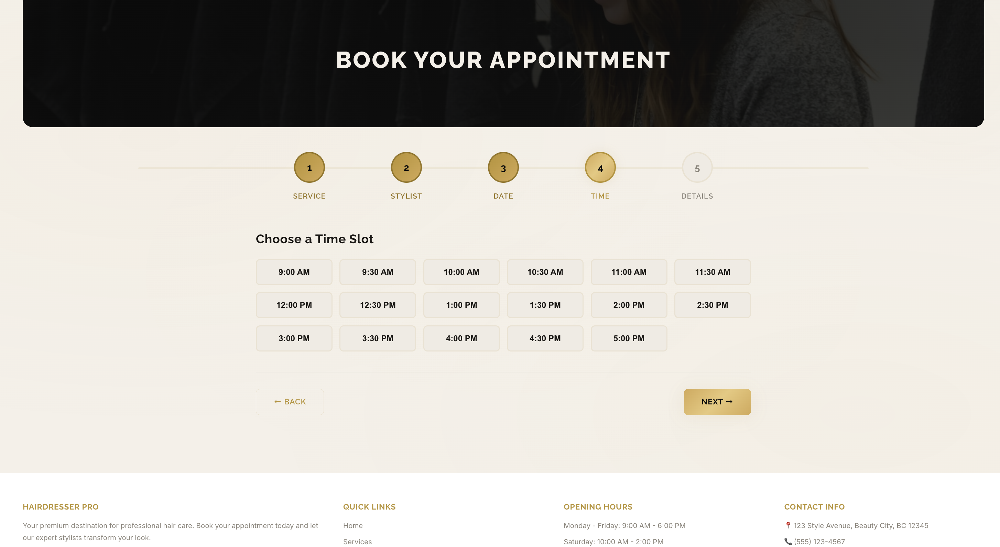
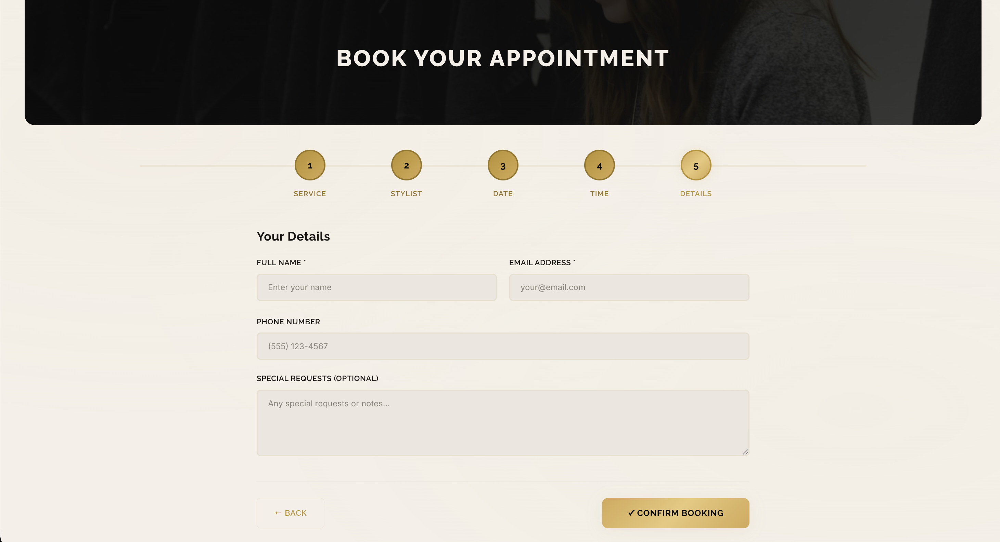
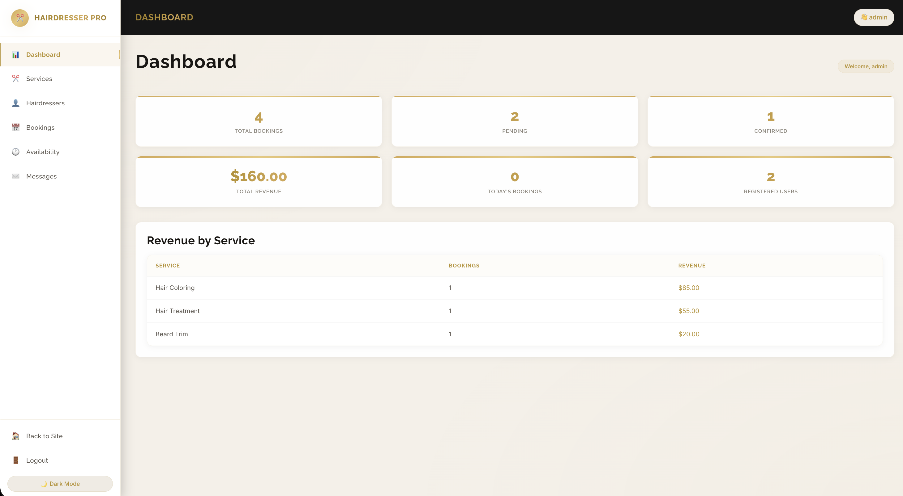

<p align="center">
  
</p>

<h1 align="center">💇‍♂️ PHP Hairdresser — Full UI & Admin Panel</h1>

<p align="center">
  <strong>A premium, full-stack hairdresser booking system built entirely from scratch.</strong><br>
  Dark &amp; Gold luxury theme • Multi-step booking • Admin dashboard • Responsive design
</p>

<p align="center">
  
  
  
  
  
</p>

---

## ⚠️ Copyright Notice

> **© 2026 June Nouh. All Rights Reserved.**
>
> This project was **designed and built entirely from scratch** by **June Nouh**.
> You may **NOT** copy, redistribute, modify, or use any part of this project
> (including code, design, assets, or UI patterns) without **explicit written permission**
> from the author.
>
> Unauthorized use, reproduction, or distribution of this project is strictly prohibited
> and may result in legal action.

---

## 📸 Screenshots & Pages

### 🏠 Homepage — Hero Section
The landing page features a stunning full-width hero banner with a dark overlay, animated gold gradient text, and a clear call-to-action. The navigation bar includes a gold-themed brand logo, smooth hover effects, and a dark/light mode toggle.


---

### 🏠 Homepage — Services Carousel & About
Below the hero, visitors see a curated services section with hover-animated cards, an about section with staggered fade-in animations, the team grid with gold-bordered avatars, and client testimonials — all wrapped in the dark & gold luxury theme.



---

### ✂️ Services Page
A dedicated services page displaying all available salon services in elegant dark cards with gold accents. Each card shows the service name, description, duration, and price — with smooth hover lift effects and gold border highlights.



---

### 📅 Booking — Step Indicators & Service Selection
The multi-step booking form features large, prominent step indicators (numbered gold circles with connecting lines). Step 1 lets the user select a service from a styled dropdown with pricing and duration info.



---

### 💇 Booking — Stylist Selection
Step 2 presents stylists in a responsive card grid. Each card displays the stylist's avatar (with gold gradient fallback), name, specialty, and bio. Cards feature gold border selection states with a subtle glow effect.



---

### 📆 Booking — Date & Calendar Picker
Step 3 integrates a Flatpickr calendar with custom dark & gold styling. The calendar matches the site theme with gold highlights for the selected date, dark backgrounds, and smooth navigation between months.



---

### 📞 Contact Page
The contact page features a hero banner with a dark gold gradient overlay, a contact information section, and a styled contact form with gold-accented input fields, textarea, and a prominent submit button.



---

### 🔐 Authentication Page
The login/register page provides a clean, centered authentication form with the dark & gold theme. It includes input fields with gold focus borders, a toggle between login and registration, and informational alerts — all wrapped in a luxurious dark card.



---

### 📊 Admin Dashboard — Overview
The admin panel features an animated statistics grid with gold gradient numbers, a section-based navigation sidebar, and real-time data overview. Stats cards display total bookings, revenue, active services, and team members with smooth entrance animations.



---

### ⚙️ Admin Panel — Management
The admin management interface includes full CRUD operations for services, hairdressers, bookings, and availability. Features include search/filter bars, responsive tables with gold-accented headers, action buttons, and a dark/light mode toggle.



---

## 🛠️ Technologies Used

This entire project was **built from scratch** — no frameworks, no templates, no Bootstrap, no Tailwind. Every line of code, every design decision, every animation was hand-crafted.

### Backend
| Technology | Purpose |
|---|---|
| **PHP 8.0+** | Server-side logic, routing, session management, form processing, CSRF protection |
| **SQLite (PDO)** | Lightweight file-based database — no server setup needed. All queries use prepared statements |
| **PHP Sessions** | User authentication, login persistence, role-based access control (admin vs user) |
| **PHP GD Library** | Dynamic placeholder image generation for services and hairdresser avatars |

### Frontend
| Technology | Purpose |
|---|---|
| **HTML5 (Semantic)** | Clean, accessible markup with proper ARIA attributes, roles, and labels |
| **CSS3 (Custom Properties)** | 2300+ lines of hand-crafted CSS with CSS variables for theming, gradients, animations |
| **Vanilla JavaScript (ES6+)** | 600+ lines — DOM manipulation, AJAX fetch calls, IntersectionObserver animations |
| **Flatpickr** | Lightweight date picker, custom-themed to match the dark & gold design |

### Design & UI Patterns
| Technique | Details |
|---|---|
| **Dark & Gold Luxury Theme** | Custom color palette: `#0b0b0b` backgrounds, `#d4a853` gold accents, gradient text via `background-clip: text` |
| **Light Mode (Warm Cream)** | Alternate theme: `#f5f0e8` backgrounds with deeper gold `#b8922e` accents |
| **CSS Custom Properties** | 40+ CSS variables for instant theme switching without JavaScript style manipulation |
| **Gold Shimmer Animations** | `@keyframes goldShimmer` for animated gradient text headings |
| **Intersection Observer** | Scroll-triggered fade-in, scale-in, and slide animations for all sections |
| **Multi-Step Form** | 5-step booking wizard with animated transitions, progress indicators, and validation |
| **Responsive Design** | Mobile-first with media queries at 576px, 768px, 992px, and 1200px breakpoints |
| **Google Fonts** | Raleway (headings), Inter (body), Playfair Display (display accents) |

### Security
| Measure | Implementation |
|---|---|
| **CSRF Protection** | Token-based form protection on every POST request |
| **Prepared Statements** | All database queries use PDO prepared statements — zero SQL injection risk |
| **XSS Prevention** | `htmlspecialchars()` on all user output via custom `h()` helper |
| **Password Hashing** | `password_hash()` with `PASSWORD_DEFAULT` (bcrypt) |
| **Input Validation** | Server-side validation for all form inputs |

---

## 📂 Project Structure

```
php-Hairdresser-Full-UI-Admin/
├── index.php              # Homepage — hero, services, team, testimonials
├── services.php           # Services listing page
├── booking.php            # Multi-step booking form (5 steps)
├── confirmation.php       # Booking confirmation with calendar export
├── contact.php            # Contact form & info page
├── auth.php               # Login / Register authentication
├── my_bookings.php        # User's booking management
├── 404.php                # Custom 404 error page
├── config.php             # Database connection & site constants
├── functions.php          # Helper functions (auth, CSRF, formatting)
├── generate_images.php    # PHP GD placeholder image generator
│
├── admin/
│   └── index.php          # Full admin dashboard (services, team, bookings, settings)
│
├── api/
│   ├── create_booking.php # AJAX endpoint — create new booking
│   ├── get_dates.php      # AJAX endpoint — fetch available dates
│   └── get_slots.php      # AJAX endpoint — fetch time slots
│
├── css/
│   └── style.css          # 2300+ lines of hand-crafted dark & gold CSS
│
├── js/
│   └── script.js          # 600+ lines of vanilla JS (booking, animations, theme)
│
├── includes/
│   ├── header.php         # HTML head, meta tags, font imports
│   ├── nav.php            # Navigation bar with theme toggle
│   └── footer.php         # Footer with site links
│
├── images/                # Service & hairdresser images
│   └── uploads/           # User-uploaded content
│
├── screenshots/           # Project screenshots for README
│   ├── 01-homepage-hero.png
│   ├── 02-homepage-services.png
│   ├── 03-services-page.png
│   ├── 04-booking-steps.png
│   ├── 05-booking-stylist.png
│   ├── 06-booking-calendar.png
│   ├── 07-contact-page.png
│   ├── 08-auth-page.png
│   ├── 09-admin-dashboard.png
│   └── 10-admin-panel.png
│
└── hairdresser.db         # SQLite database file
```

---

## 🚀 Quick Start

### Requirements
- **PHP 8.0+** with `pdo_sqlite` extension
- No database server needed — SQLite is file-based

### Installation

```bash
# Clone the repository
git clone https://github.com/JuneNouh/php-Hairdresser-Full-UI-Admin.git

# Navigate to project
cd php-Hairdresser-Full-UI-Admin

# Start PHP built-in server
php -S localhost:8000

# Open in browser
open http://localhost:8000
```

### Default Admin Access
Navigate to `/admin` to access the admin dashboard. Create an admin account through the registration page or directly in the SQLite database.

---

## ✨ Key Features

- 🎨 **Dark & Gold Luxury Theme** — Hand-crafted premium design with gold shimmer animations
- 🌗 **Dark / Light Mode Toggle** — Seamless theme switching with CSS custom properties
- 📅 **5-Step Booking Wizard** — Service → Stylist → Date → Time → Details
- 👨‍💼 **Full Admin Panel** — CRUD for services, team, bookings, availability & analytics
- 📱 **Fully Responsive** — Mobile-first, looks perfect on all screen sizes
- 🔒 **Secure by Design** — CSRF tokens, prepared statements, XSS prevention, bcrypt hashing
- 📧 **Email Notifications** — Booking confirmations (configurable)
- 📅 **Calendar Export** — ICS file generation for Google Calendar / Apple Calendar
- 🔍 **Search & Filters** — Filter bookings by date, status, and stylist
- ♿ **Accessible** — ARIA labels, keyboard navigation, semantic HTML

---

## 👨‍💻 Author

**June Nouh**

Built entirely from scratch — every line of code, every pixel of design.

---

## 📜 License

**All Rights Reserved © 2026 June Nouh**

This project is proprietary. You may **not** copy, modify, distribute, or use any part of this project without explicit written permission from the author. See the [Copyright Notice](#️-copyright-notice) above.